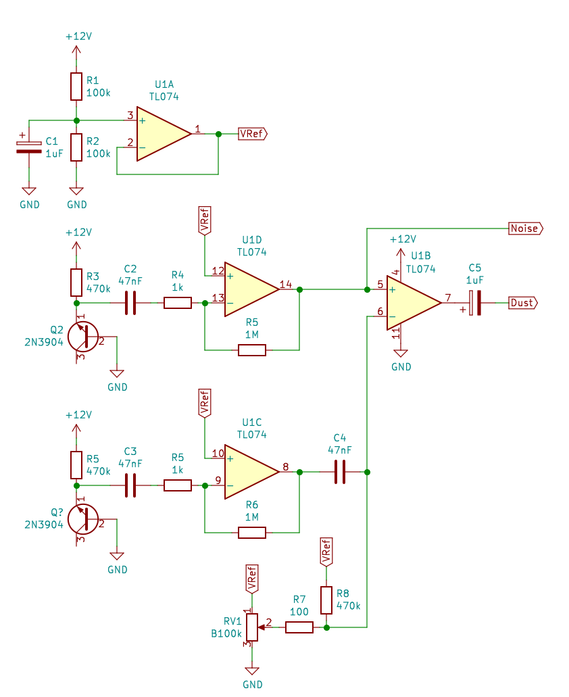

Dust and Noise Generator
========================

This is a combination of two circuits.  Firstly, there are two white noise
generators, based on the method of leaving the collector of a transistor open.
This was directly inspired by [Rene Schmitz's version](https://www.schmitzbits.de/noise.html).

The second circuit is inspired by the Dust generator on the [Ciat-Lonbarde Plumbutter](http://ciat-lonbarde.net/plumbutter/labrolzpapersz.pdf).
This uses a comparator to compare the outputs of the two noise generators, producing a rectangular wave with random pulse width and random frequency.  An offset voltage is applied to one of the noise generators, which allows you to tune the frequency of the length of time the rectangular wave is non-zero.  At high voltage values the comparator will trigger less often that at low voltage values.  The sound produced can range from needle-on-vinyl like crackling to full-spectrum white noise.

 
