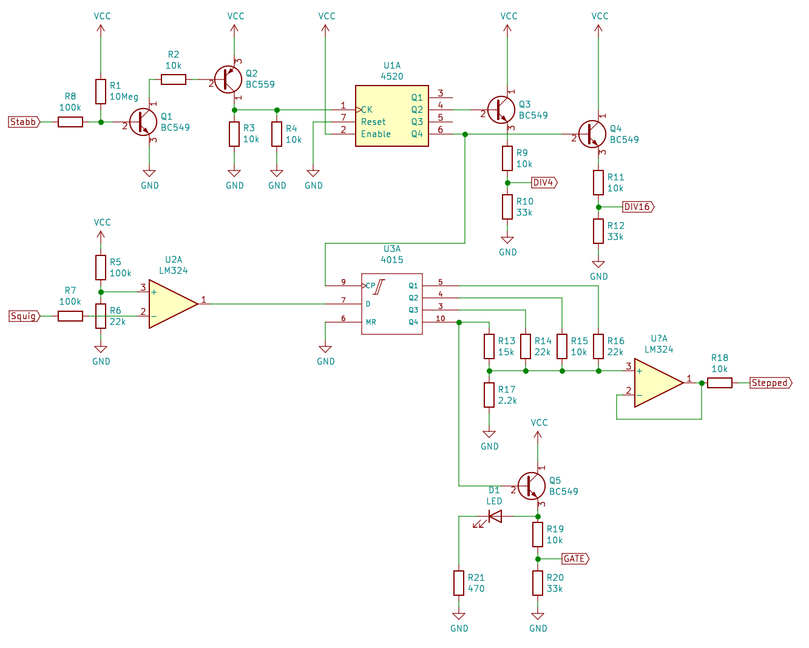
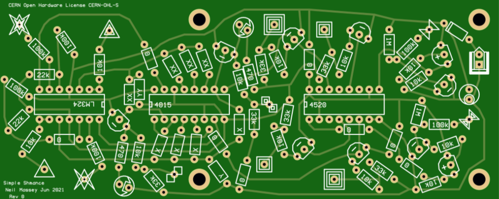

Simple Sh'mance for Fourses Tarp
================================

This is a simple circuit I designed as a complement to the Fourses Tarp by Ciat-Lonbarde that I built.  [Ciat-Lonbarde](http://ciat-lonbarde.net/) produce some wonderfully esoteric instruments, encased in wooden shells.  Peter Blasser, the man behind CL, also provides circuits designed to be [built on paper](http://ciat-lonbarde.net/paper/index.html).

These circuits are essentially open-source (although no license is given) and the synth DIY community have, from time to time, offered these circuits for sale as PCBs.  I bought my Fourses Tarp PCB from [Fluxmonkey](http://fluxmonkey.com/pcbDocs/foursesTarp.htm) and the original paper circuit is [here](http://ciat-lonbarde.net/paper/fourses.pdf).  Building it was nicely straight forward.  I made the usual mods of having switches for different values of the timing capacitors.

There are three different Fourses circuits in the paper circuit portdock: Fourses Tarp, Fourses ArpSerge and Fourses TarpTerge.  The last two can be used with an extra circuit in the portdock called the Intersexon, a type of sample and hold, which can be used with two Fourses to cross modulate signals between the two.  Fourses Tarp cannot be used with the Intersexon as it has no "castle cuck" node with which to perform current mirroring between two nodes.

In the [Eurorack version of Fourses](http://www.synthmall.com/ifm/ifmFRS.pdf) it is suggested to use sample and hold modules from the "Eurorack consortium".  I wanted something a bit less random, yet chaotic, so instead of sampling (and holding) an arbitrary voltage, I decided to design a circuit that would generate a finite set of voltages, but in a random order.

Peter Blasser uses the term "sh'mance" for a kind of control voltage generation circuit in his [Oval synthesizers](https://econtact.ca/17_4/blasser_ovalsynth.html).  Although my version is much less complicated than Peter's sh'mance, it still operates in a similar way.  It uses a digital shift-register with inputs and clock from analog oscillators, plus a resistor network to generate a stepped control voltage from the digital outputs of the shift-register.  It can be used in the following way:

* The "Stabb" input requires a trigger input.  The transistors condition the trigger to drive the CD4520 chip.  This input should be connected to any "Stabb Councillor" node from the Fourses Tarp.
* The "Squigg" input can be used with any time-varying signal.  The first op-amp is a comparator which feeds either a zero or one into the data input of the CD4015 chip.  This input can be connected to the "Wiggler Hard Out" or the "Extensive Squiggler" nodes.
* The CD4520 divides the clock signal.  The /4 and /16 outputs are available as output gates via a transistor and voltage divider.  These output gates can be connected to any node on the Fourses Tarp, but work well on the "Extensive Squiggler" nodes (aka Bounds in IFM-parlance) as, when the gate is high the oscillator sounds, yet when it is low it does not sound.
* The /16 output of the CD4520 is fed to the clock input of the CD4015.  Every time the clock input is high, a binary sample is taken from the data input.
* The CD4015 is like a 1-bit delay unit.  Every time the clock input is high the bit sampled at the data input is passed down a line of 4 1-bit registers.  After 4 clock pulses, the bit is thrown out of the end of the shift register.
* The outputs of the shift register (each 1-bit register) is combined using a resistor summing network (R13-R16).  The magnitude is set by R17.  This network produces a stepped wave, which is buffered by the op-amp and made available at the "Stepped" output
* The final bit in the shift-register is also available as a gate via a transistor.  It is also connected to an LED for Blinkenlichts.

I had PCBs made for these!  The Gerber files are in the repository.

* There are two simple sh'mances on each PCB.  The CD4520 and CD4015 are both dual chips, so it seemed rude not to.
* The X resistors are R13-R16 in the schematic.  These set how much influence each bit in the register has on the final stepped wave.  The higher the X resistance, the less influence that bit will have.  Having all X resistors the same value will result in each bit having equal influence.
* The Y resistor is R17.  This sets the magnitude of the stepped-wave: the higher the Y resistance, the higher the voltage.
* The XX resistors and YY resistors are the same but for the other sh'mance on the board.
