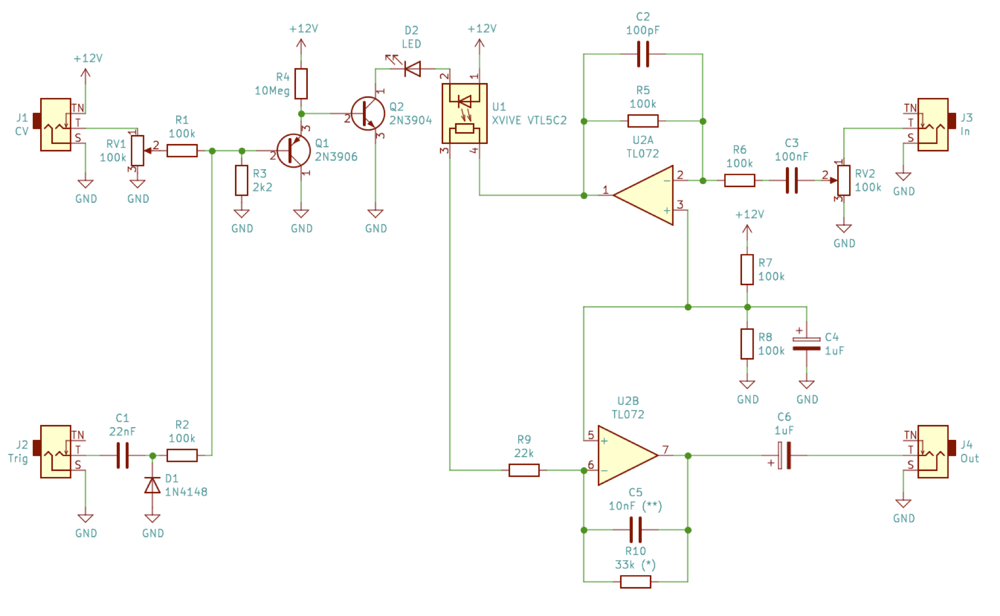

Low Pass Gate / Voltage Controlled Amplifier
============================================

This is an active version of the ubiquitous "passive low pass gate" which crops
up on countless internet forums and Etsy accounts.  One of the nicest examples,
and the direct inspiration for this circuit, is the
[Meng Qi DPLPG](https://www.mengqimusic.com/dplpg)

By turning this into an active (requires power), rather than passive (requires
no power to function), I believe I have improved the response of the Low Pass
Gate (LPG) to control voltage (CV).  I've incorporated the exponential vactrol
driving circuit from Scott Stites
[Mutant Vactrol Filter](http://www.birthofasynth.com/Scott_Stites/Pages/mutant_main.html).

I've also added a "Trigger" input, as well as the normal CV input.  This allows
you to "ping" the LPG to create short envelopes and produce the "Buchla Bongo
Sound" so beloved of modular synthesists.

I've tuned the circuit on the breadboard, working on a 12V supply.  There are
several components in the circuit that are worth experimenting with:

* Capacitor C1.  This determines how long the "ping" is when there is a positive
voltage applied to the trigger input.  A higher capacitance will create a longer
ping.

* Capacitor C5.  A LPG is a combination of a low pass filter (LPF) and a voltage
controlled amplifier (VCA).  This capacitor controls the cut off frequency of
the LPF.  The greater the capacitance, the "darker" the sound.  Experiment with
values between 1nF to 100nF.

* Resistor R10.  This controls the gain of the inverting op-amp U1B.  Increase
R10 to increase the gain.  In combination with potentiometer RV2, this can
create a LPG that saturates the signal, adding distortion and extra harmonics.
The 33k resistor (R10) in combination with the 22k resistor (R9) gives a gain of
1.5.  This is enough to compensate for the loss of signal through the light
dependent resistor (LDR) part of the vactrol.
A nice balance point would be to increase R10 to a value that produces the same
gain of the input signal (x 1.5) when the RV2 pot is set at 12 o'clock.  This
would then produce a variable amount of distortion when the pot is turned
clockwise.

Finally, vactrols have a reputation for being expensive nowadays.  I use Xvive
VTL5C2, for which I have paid between £5 and £10 for 5 of them on the UK version
of eBay.  Vactrols can also be "hand rolled" using a LED, LDR and some
heat-shrink tubing.  There are many tutorials on the World Wide Web showing you
how to do this.

