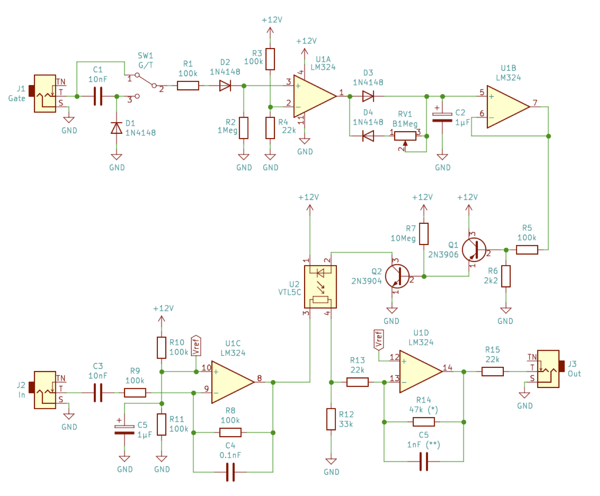

Low Pass Gate with Decay Envelope
=================================
This is an extension of the [LPG_VCA](./LPG_VCA.md) that also incorporates a
decay envelope controlling the LPG / VCA.  The decay time is adjustable via the
1 Meg potentiometer (RV1).  The envelope is a simplified and tuned version of
the one on [Synthnerd's website](https://synthnerd.wordpress.com/2016/04/06/envelope-circuits-a-simple-ar-design-using-op-amps/).

Whether CV input results in a gate or trigger are now selectable via a switch,
rather than the separate inputs on the original circuit.

Other changes are due to tuning on the breadboard.  Adding the 33K resistor (R12)
to ground ensures that the VCA can fully shut off when no CV is provided.  This
resistor could be replaced by a 25K or 50K trimmer to precisely tune the shut off
of the LPG / VCA.

