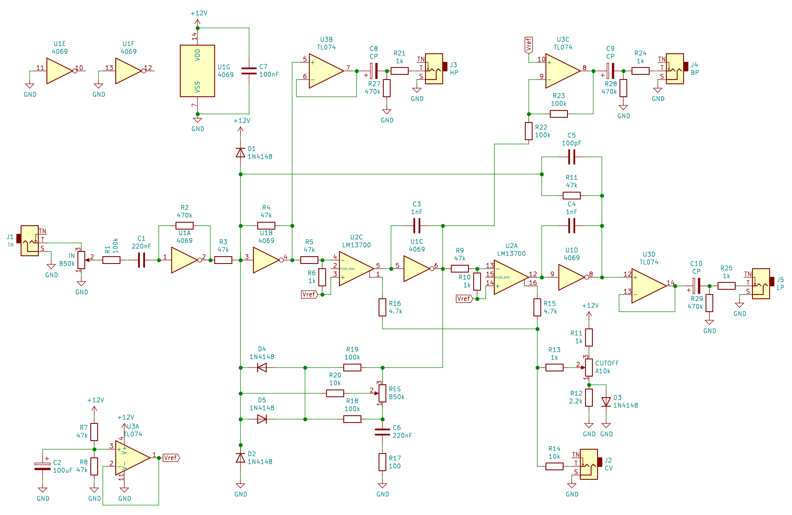

4069 CMOS State Variable Filter / Wasp filter
=============================================

This is a version of the state variable filter found in the [EDP Wasp](https://en.wikipedia.org/wiki/Electronic_Dream_Plant#Wasp) synthesizer from 1978s.  This is a popular circuit for synth DIY-ers to build and is especially well suited to running on a single supply as it uses (and abuses) CMOS 4069 logic inverters as inverting op-amps.  It has a State Variable Filter topology, which means you can get simultaneous high-pass, band-pass and low-pass outputs from the filter.

The direct inspirations for my version are the Jurgen Haible version from the [Rene Schmitz website](https://www.schmitzbits.de/wasp.html) and [Ken Stone's version](https://sdiy.info/wiki/CGS_twin_CMOS_filter).

I made a number of changes to make it more suitable for modern components and for interfacing with other instruments and effects pedals.

* Changed the 2 x CA3080s OTAs to a single LM13700 OTA (Operational Transconductance Amplifier)
* Changed the resistors to use the E3 series, reducing the number of different values of resistors needed
* Added a buffered reference / virtual ground voltage using an op-amp
* Added buffered outputs for each of the filter outputs, using op-amps.  The phases of the outputs are also returned to the phase of the input.
* Lots of tuning on the breadboard!
* The main difference is that I have removed the triple distortion section that occurs after the filter in the Jurgen Haible and Ken Stone version and added a high gain stage to the input, with clipping diodes.  This squares up the input signal and distorts it (depending on the the setting of the input potentiometer) before the filter, adding an "acid" edge to it.

